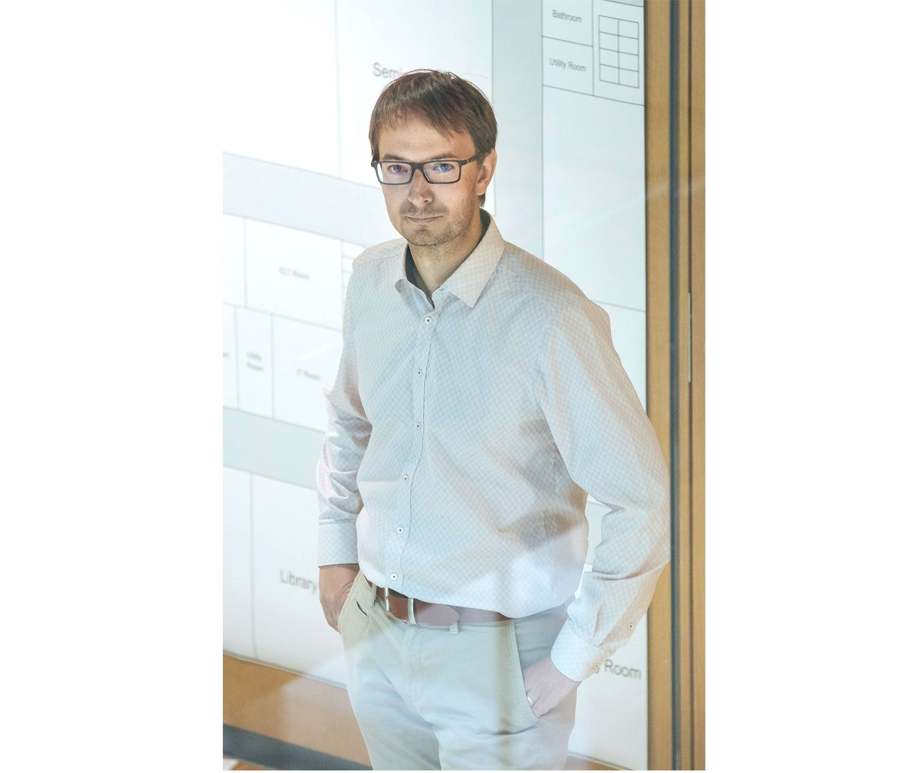

# Overview

The overarching goal of this workshop is to gather researchers, students, and advocates who work at the intersection of accessibility, computer vision, and autonomous systems. By actively supporting the engagement of people with disabilities in the workshop (as speakers, panelists, attendees), we will take a step towards building a community for accessibility research at computer vision conferences. Specifically, we plan to use the workshop to identify challenges and pursue solutions for the current lack of shared and principled development tools for data-driven vision-based accessibility systems. For instance, there is a general lack of vision-based benchmarks and methods relevant to accessibility (e.g., people with disabilities and mobility aids are currently mostly absent from large-scale datasets in pedestrian detection). More broadly, our workshop will provide a unique opportunity for fostering a mutual discussion between the accessibility community, computer vision, and robotics researchers. 

# Invited Speakers
**Talk 1: Title**

<a href="https://staging-temp-site.github.io/staging-temp-site.gitub.io/">Lecturer</a> [description]
  
   
   
   
  
   
   

**Talk 2:  Title**

<a href="https://staging-temp-site.github.io/staging-temp-site.gitub.io/">Lecturer</a> [description]
  
   
   
   
  
   
   

**Talk 3: Title**

<a href="https://staging-temp-site.github.io/staging-temp-site.gitub.io/">Lecturer</a> [description]
  
   
   
   
  
   
   

**Talk 4: Title**

<a href="https://staging-temp-site.github.io/staging-temp-site.gitub.io/">Lecturer</a> [description]
  
   
   
   
  
   
   

**Talk 5: Title**

<a href="https://staging-temp-site.github.io/staging-temp-site.gitub.io/">Lecturer</a> [description]
  
   
   
   
  
   
   

**Talk 6: Title**

<a href="https://staging-temp-site.github.io/staging-temp-site.gitub.io/">Lecturer</a> [description]
   
   
   
   
  
   
   

## Call for papers
We invite interested researchers to submit relevant work related to robust learning for real-world applications. Please refer to the **[call for papers](./call-for-papers.html)** page for more details.

## Important workshop dates
- Workshop announcement: <strong>TBD</strong>
- Workshop paper submission deadline: <strong>TBD</strong>
- Notification to authors: <strong>TBD</strong>
- Camera ready deadline: <strong>TBD</strong>

## Challenge details

We will host a challenge on robust activity recognition in videos in conjunction with this workshop.
This challenge invites participants from both academia and industry to develop robust activity
recognition models which will be tested for robustness against various perturbations.

Please refer to the **[challenge page](./challenge.html)** for more details.

The challenge deadlines are as follows:
- Challenge announcement: <strong>TBD</strong>
- Release of testing data: <strong>TBD</strong>
- Leaderboard open: <strong>TBD</strong>
- Challenge submission deadline [paper track]: <strong>TBD</strong>
- Challenge submission deadline: <strong>TBD</strong>
- Winner announcement: <strong>TBD</strong>

## Schedule

| Time | Event | Duration |
| ----- | ----- | ----- |
 |   |  

## Organizers

  

     
    <a href="https://eshed1.github.io/">Eshed Ohn-Bar</a> 
    Boston University
  

  
  

  

   
  

     
  <a href="https://home.cs.colorado.edu/~DrG/AboutMe.html">Danna Gurari</a> 
    University of Colorado Boulder
  

  
  

  

   
  

     
  <a href="http://www.cs.cmu.edu/~kkitani/">Kris Kitani</a> 
    Carnegie Mellon University
  

  
  

  

   
  

     
  <a href="http://ai.bu.edu/ksaenko.html#">Kate Saenko</a> 
   Boston University
  

  

     
    <a href="http://www.cvlibs.net/">Andreas Geiger</a> 
    University of Tübingen and the MPI for Intelligent Systems
  

  
  

  

  
  

     
  <a href="https://researcher.watson.ibm.com/researcher/view.php?person=us-chiekoa">Chieko Asakawa</a> 
    Carnegie Mellon University and IBM
  

  

  

  
  

     
  <a href="https://jonfroehlich.github.io/">Jon E. Froehlich</a> 
    University of Washington
  

  
  

  

  
  

     
  <a href="https://www.linkedin.com/in/chandrikajayant">Chandrika Jayant</a> 
    Volkswagen Group of America
  

## Advising committee

  

     
    <a href="https://staging-temp-site.github.io/staging-temp-site.gitub.io/">[Name]</a> 
    [Institution]
  

  
  

  

   
  

     
  <a href="https://staging-temp-site.github.io/staging-temp-site.gitub.io/">[Name]</a> 
    [Institution]
  

## Program Committee

| --- | --- |
|  |  |

## Student Organizers

| --- | --- |
|  |  |

### Join our **[mailing list](https://staging-temp-site.github.io/staging-temp-site.gitub.io/)** for updates.
For any questions, please contact **Eshed Ohn-Bar [eohnbar@gmail.com]**.

## Videos

    

      <h4><u>OpenGuide</u> </h4>
        <iframe src="https://www.youtube.com/embed/mGq9sL1spzc" frameborder="0"
          allow="accelerometer; autoplay; encrypted-media; gyroscope; picture-in-picture"
          style="width:100%; clip-path:inset(1px 1px);height: 30vh" allowfullscreen></iframe>
    

    

        

    

    
    <!--div align="center"  style="width:45%; float: left;">
      <h4 ><u>X-World</u> </h4>
      
        <iframe src="https://www.youtube.com/embed/z_YwWIZWg58" frameborder="0"
          allow="accelerometer; autoplay; encrypted-media; gyroscope; picture-in-picture"
          style="width:100%; clip-path:inset(1px 1px); height: 30vh" allowfullscreen></iframe>
      
    </div-->
  

